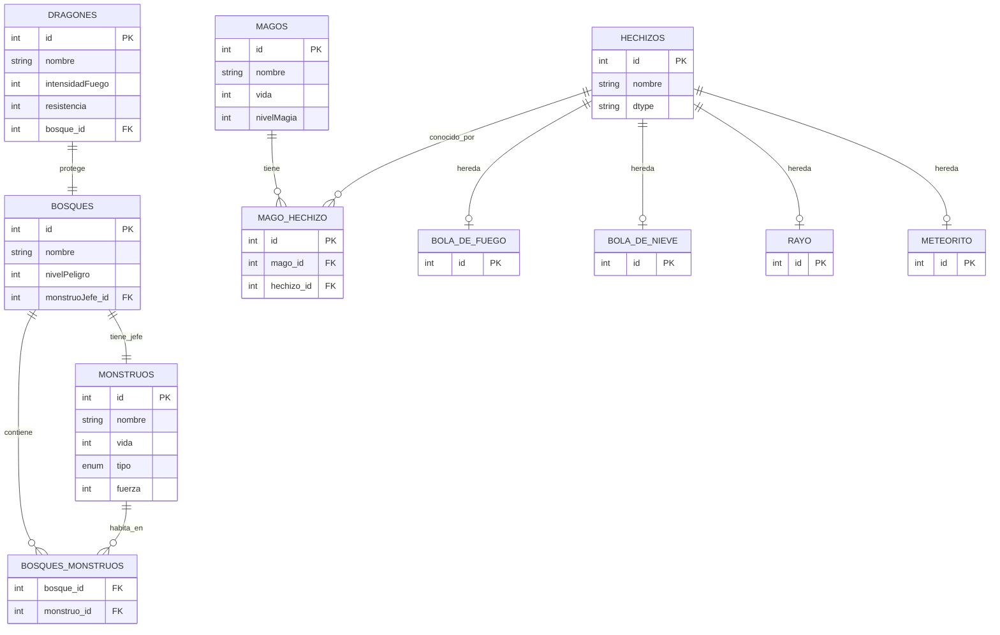

# Dragolandia

## Introducción
**Dragolandia** es una aplicación de aventura medieval desarrollada en Java que simula batallas épicas por el control de un bosque mágico. Utilizando tecnologías como **Maven** e **Hibernate**, el proyecto implementa un sistema de persistencia completo con MySQL.

### Contexto del Juego

En el mundo de Dragolandia, un grupo de magos valientes se enfrenta a hordas de monstruos que han invadido un bosque sagrado. Los magos, con sus poderosos hechizos, deben eliminar a todos los monstruos y derrotar al monstruo jefe para reclamar el bosque. Un dragón protector ayuda en la batalla atacando al líder enemigo.

### Características Principales

- **Sistema de combate por turnos**: Magos lanzan hechizos, monstruos atacan y el dragón exhala fuego.
- **Gestión de vida**: Los personajes muertos son eliminados automáticamente del combate.
- **Persistencia de datos**: Todas las entidades se almacenan en una base de datos MySQL mediante Hibernate.
- **Patrón MVC**: Arquitectura organizada en Modelo-Vista-Controlador.
- **CRUD completo**: Operaciones de creación, lectura, actualización y eliminación para todas las entidades.

## Análisis
### Diagrama de clases

## Diseño
### Diagrama entidad relación

