# Manual de usuario de Dragolandia

## Índice

1. [Preparación de la partida](#preparación-de-la-partida)
    1.1. [Creación del terreno de juego](#creación-del-terreno-de-juego)
    1.2 [Creación de los enemigos](#creación-de-los-enemigos)
    1.3 [Creación de los magos](#creación-de-los-magos)
    1.4 [Creación del dragón](#creación-del-dragón)
    1.5 [Asignación de los enemigos](#asignación-de-los-enemigos)
2. [Inicio de la partida](#inicio-de-la-partida)
3. [Fin de la partida](#fin-de-la-partida)

## Preparación de la partida

### Creación del terreno de juego

Primero debemos nombrar nuestro terreno de juego, el bosque.

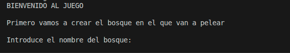

Una vez creado el bosque debería de aparecer este mensaje

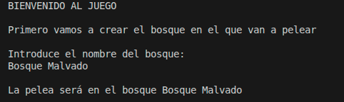

### Creación de los enemigos

En este juego los enemigos son monstruos. Estos pueden ser de 3 tipos: Ogros, Trolls o Espectros. Aunque esta característica se genera aleatorimente, tu solo les debes dar el nombre a los enemigos.

Pero antes debes de elegir el número de enemigos, mínimo deben ser 3.

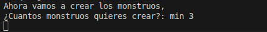

Una vez hecho esto, ahora debes nombrarlos

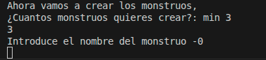

Una vez creado te salta un mensaje de confirmación

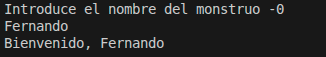

Ahora repite esto cuántas veces tu elegiste

### Creación de los magos

Una vez creados los enemigos, necesitamos crear a los magos que pelearan contra ellos.

Para eso vas a elegir, otra vez, cuantos magos quieres tener en el equipo, mínimo son 2 magos.

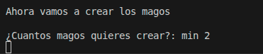

Una vez elegido el número de magos debes nombrarlos.

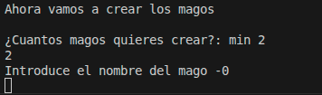

Cuando lo nombres te saltará un mensaje de confirmación.

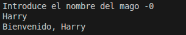

Una vez elegido el nombre debes elegir sus hechizos. Tienes 4 opciones: Bola de fuego, Bola de nieve, Rayo y Meteorito. Cada uno con sus respectivos efectos. Necesitas seleccionar un mínimo de 2 hechizos para poder continuar.

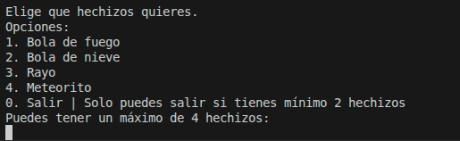

Cuando selecciones uno se eliminará automáticamente para la siguiente elección.

Una vez elegidos los hechizos debes repetir este proceso de nombramiento y elección para el número de magos que elegiste.

### Creación del dragón

Una vez creados los magos, necesitamos crear nuestro dragón. Para eso debes darle un nombre.

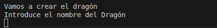

### Asignación de los enemigos

Una vez creados los personajes, asignamos los enemigos al bosque. 

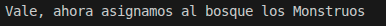

El primer monstruo creado será el jefe del bosque.

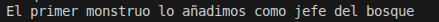

Los demás monstruos se añaden automáticamente como enemigos normales al bosque

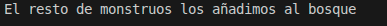

## Inicio de la partida

El juego va por rondas. Primero atacan los magos. La elección de hechizos es aleatoria. Pueden intentar atacar con hechizos que no conocen y hacerse 1 de daño a ellos mismos.

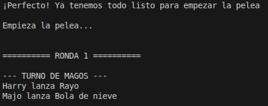

Después contraatacan los monstruos, haciendo el mismo daño que nivel de fuerza correspondiente.

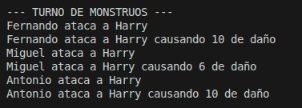

Por último ataca el dragón al monstruo jefe, haciendo el mismo daño que puntos de exhalar.

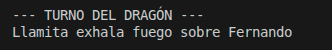

Al final de cada turno se limpian a los muertos y se muestra el estado de la partida.

Todas las rondas tienen el mismo orden. Salvo que cuando muere el monstruo jefe se asigna el siguiente monstruo como jefe del bosque.

## Fin de la partida

La partida termina cuando todos los magos se queden sin vida o todos los monstruos se queden sin vida.

Dependiendo de esto pueden ganar los magos.

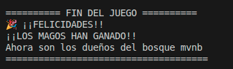

O pueden ganar los monstruos.

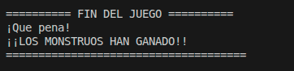

Al final de la partida te da la elección de limpiar la base de datos para no guardar los resultados de la partida.

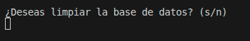